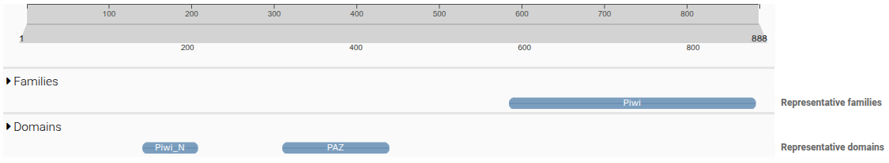
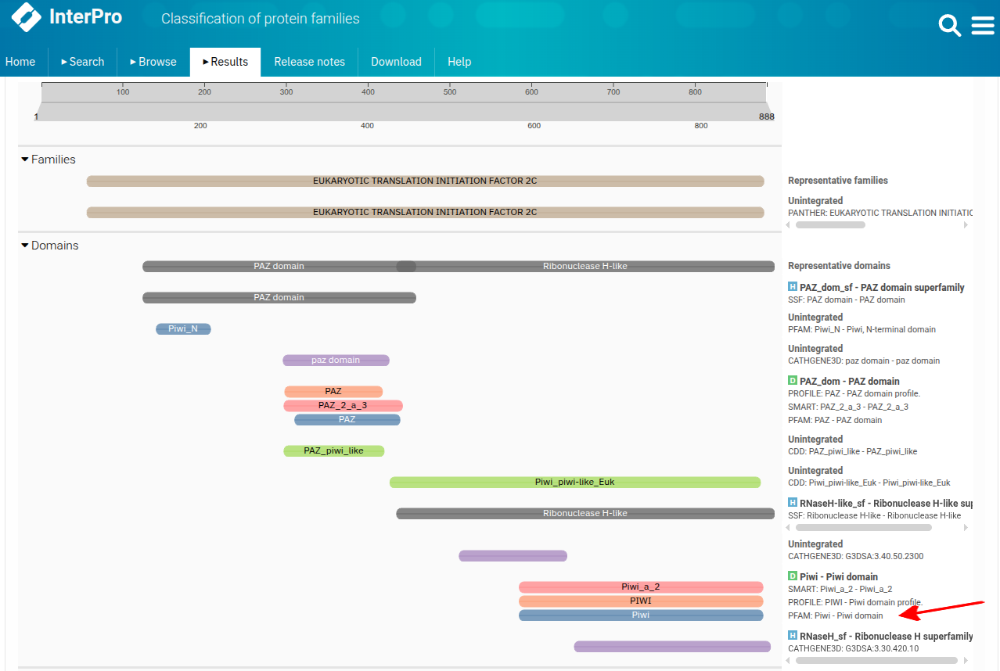
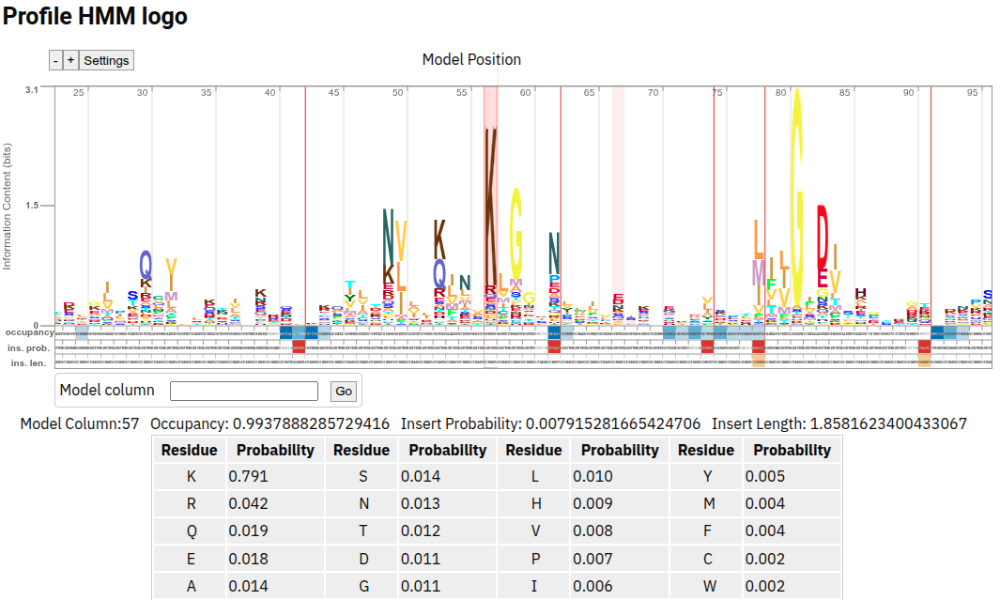
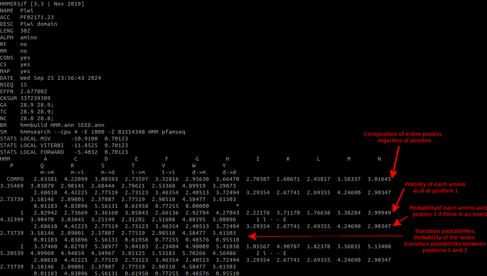

# Protein domain searches

## Intro

As we have seen in recent lectures, the key to a protein's function lies in its shape and its distribution of charges. In lecture 7, we learnt about the modularity of proteins and their architectural organisation into 'domains'. These domains perform specific and conserved roles in proteins and are frequently rearranged over evolutionary time to create various configurations that carry out specific roles.



Before we start today, remember that as we are conducting searches and analyses that generate data that will ultimately end up in our final report and presentation, we need to be continually updating the RMarkdown doc we started a couple of weeks ago. 

## InterPro

We can investigate protein domain architecture using an online tool called [InterPro](https://www.ebi.ac.uk/interpro/) which collates a number of databases which have been produced over the years for protein domain annotation. On the front page, you will see options to search by text, by domain architecture or be sequence. As we want to investigate what is going on in our sequences, choose `Search by sequence` and paste in one of the amino acid fasta fasta sequences from the multi fasta file you've been working on. Click `Advanced options` to see the list of databases that InterPro integrates and then click `Search` when you are ready. On the next page, click the sequence name once the search is complete.

On the results page, you will see a bunch of coloured boxes with protein domain names in them. There is a lot of redundancy here because most of the domain architecture tools identify similar protein domains, even though they all use unique methodologies to do so.



I will click the `PFAM` link to the `Piwi domain` indicated by the red arrow but you should tailor this to the appropriate domain based on the gene family you are investigating. This will take you to a page that gives you a description of the domain, but also provides details on how the domain was defined. 

Here is a table of the characteristic domains of your individual gene families:

| Family | Pfam domain | Pfam ID | Also hits | Filter |
| --- | --- | --- | --- | --- |
| Pax | PAX (paired domain) | PF00292 | Largely Pax-specific | None needed |
| Six | SIX1_SD (Six domain) | PF16878 | Six-specific | None needed |
| Smad | MH2 | PF03166 | Smad-like MH2 proteins in some invertebrates (e.g. *Drosophila* Expansion/Rebuff) | Require MH2 near the C-terminus |
| GATA | GATA zinc finger | PF00320 | Proteins with a single GATA-type zinc finger | Require two domain hits per protein |
| Frizzled | Frizzled/Smoothened membrane region | PF01534 | Smoothened (the outgroup) | Separate FZD from SMO by tree or BLAST. |
| Sirtuins | SIR2 | PF02146 | Sirtuin-specific, including bacterial sirtuins | None needed |
| Argonaute/Piwi | Piwi | PF02171 | Argonaute/Piwi proteins | None needed |

Recall from the lecture that protein domains are defined by Pfam using a `Hidden Markov Model`. An `HMM` is a matrix of probabilities of seeing any of the 20 amino acids at each location in an alignment. Click on `Profile HMM` to see a HMM logo of the Pfam Piwi domain.



Like with BLAST, we can use hidden markov models to identify proteins containing specific domains on the command line. Switch over to your terminal and create a new folder in your `/data/users/username/tut_4` for this, giving it a logical name and if need be, create new folders within this for different searches. It's up to you how you control your directory structure but it is very important that it follows a logical system and is readable by others, and by your future self.

### HMM search on the command line
The next thing we need to do is to obtain a raw HMM to use to search our proteome. Go back to the InterPro page and under `Profile HMM` right click on the `Download` link and click `copy link address` in Chrome or `copy link` in Firefox. Now in your R, start creating the download command like this:

```R
setwd("/data/users/username/tut_4/hmmsearch")
url <- "INSERT_YOUR_URL_HERE"
```

The `setwd()` command sets your working directory so R downloads to the correct location. Now go back to your browser, right clink on `Download` again and click `inspect element` in Chrome or `inspect` in Firefox. You'll now see a highlighted line of code that includes  `PF02171.hmm.gz`. Copy just this part and add it to your download command so that it now looks like this:

```R
setwd("/data/users/username/tut_4/hmmsearch")
url <- "INSERT_YOUR_URL_HERE"
destfile <- "PF02171.hmm.gz"
download.file(url, destfile)
```

You can now execute this command to download the HMM. To inspect it within R, try the following:

```R
PF02171 <- gzfile("PF02171.hmm.gz", "rt")

# Read first 30 lines
lines <- readLines(gzfile("PF02171.hmm.gz"))
```

Alternatively, you can do the same with bash. Go to your terminal and type the following but don't hit enter yet:

```bash
wget INSERT_YOUR_URL_HERE
```

Now go back to your browser, right clink on `Download` again and click `inspect element` in Chrome or `inspect` in Firefox. You'll now see a highlighted line of code that includes `PF02171.hmm.gz`. Copy just this part and add it to your wget command like this:

```bash
wget "INSERT_YOUR_URL_HERE" -O PF02171.hmm.gz
```

You can now hit enter. wget is a command to download files from the internet to your current location. When a URL links directly to a filename, you don't need to include the `-O` option but as this URL points to an API endpoint, you do need to give wget a name to save the file as.

As this file is gzipped, you can't just inspect it directly, for example with `cat`. Instead, try using `zcat` and then pipe the output to `less`.



You don't need to memorise every component of this file format but it is good to understand the broad concept that an HMM is a large matrix describing the *probability* of finding any particular amino acid at each specific location.

Now we can use the pre-installed `hmmsearch` command to identify Piwi domain containing peptides in our transcriptome. While this is done using the Bash shell, remember that you can run these sorts of scripts within R using the `system()` command. An example will be provided below.

On the command line, navigate to the hmm folder you created earlier and then run `hmmsearch -h` to see all the options available. At the top you will see the basic usage instructions:

```bash
Usage: hmmsearch [options] <hmmfile> <seqdb>
```

This tells you that to run hmmsearch, at a minumum you require an `hmmfile` (the file we downloaded from InterPro) and a seqdb which is just a protein fasta file. Have a go at constructing your own hmmsearch command but make sure to include `-o` to define an output file as well as `--tblout` to define a per-sequence hit output table. To do this, use the hmmfile you just downloaded and use it to search against the human proteome we used to build the `blastp` database from last week BUT make sure you use the fasta file this time, not the set of files that constitute the blastp database.

Examine both output files. Use your bash scripting or R skills to create lists of protein identifiers (those starting with `ENSP`), transcript identifiers (those starting in `ENST`) and gene identifiers (those starting in `ENSG`). How many of each did it find? Inspect the e-values. Are there any outliers?  What parameters would you modify if you were to run this search again?

It is also possible to download the entire Pfam HMM database and then use the command `hmmscan` to identify all protein domains withing a protein of interest, although we might only try this out if we have the time.

## RMarkdown docs
Now would be a good time to update our RMarkdown docs to reflect all the work we've just done to try and identify candidate gene family members from the human proteome.

# Multiple sequence alignment

## MSA

By this stage you should have created a multi fasta file containing the amino acid sequences of all the genes in your allocated gene family from humans. Our task now is to take that fasta file and use it to create a multiple sequence alignment (MSA) which we will be able to use subsequently as input to build a phylogenetic tree.

Today we will be trying to do as much as we can in R so make sure to write all your code and comments into your RMarkdown document. Remember, this document will be assessed and it should be completely understandable as a stand along document by an external reader. For that reason, it is extremely important that you give sufficient details at every step about what you are doing and why. If you are importing a file that you created outside of this document (ie. your multi fasta), you should write a paragraph or two explaining what the file is that you are importing and how it was created. For all code, make sure you comment it well using comment lines (# Followed by a comment).

As we will be operating out of our working directory in R, make sure you setwd() correctly. You'll also need to create a new directory for all your MSA files.

```R
setwd("/data/users/username/phylogenetic_project")
dir.create("msa")
```

Next you'll need to import your fasta file and use this to create an AAStringSet object, which is a data structure native to the `Biostrings` package used for efficient fasta processing. As we are using the `Biostrings` package, you'll first need to load it. I like to have a code chunk right at the top of my RMarkdown document where I import all the libraries I'll need at the beginning. As you don't want to mess your final pdf file up with unnecessary output text, I would set `echo` to TRUE and `include` to FALSE.

Remember, when importing your fasta file it's important to get the location correct. A moment ago we created a new directory for our MSA work, but the fasta file we created two weeks ago will be in a different location. Your options are to move the fasta to your new folder, to copy it to your new folder or to just ensure that you use the correct location when importing the file into R. I'll go with that third option here.

```R
# Load library
library(Biostrings)

# Import fasta
fasta <- "../tut_2/aqp_multi_fasta.fa"
seqs <- readAAStringSet(fasta)

# Have a quick look to see if it has imported correctly.
seqs
```

Now we are ready to perform our first alignment. For our first attempt, we are going to use the `msa` package from within R but later we'll try another package called `MAFFT`. As it runs in the shell though, rather than in R, we'll either need to switch over to the command line for this or wrap it in a system command within R. But, I digress. Back to `msa`!

```R
# Load library
library(msa)

# Perform the alignment. Try Muscle algorithm first, but other options are ClustalW and ClustalOmega
aligned <- msa(seqs, method="Muscle")

# Have a look at the alignment
aligned

# Convert to AAMultipleAlignment for further analysis
aligned_aa <- as(aligned, "AAMultipleAlignment")

# Have a look at the AAMultipleAlignment object
aligned_aa

```

This package also allows us to modify parameters of the algorthm (ClustalW, ClustalOmega, Muscle) such as the `gap opening penalty`, the `gap extention penalty` etc, but it also allows for different substitution matricies. Have a go and see if you get major differences using a matrix other than the BLOSUM62 default:

"BLOSUM30", "BLOSUM40", "BLOSUM50", "BLOSUM62", "BLOSUM80", "PAM30", "PAM70", "PAM120", "PAM250"

```R
# Load the matrix you want to try from the Biostrings package
data("BLOSUM100")

# Rerun the alignment using the new substitution matrix
aligned_BLOSUM100 <- msa(seqs, method="Muscle", substitutionMatrix = BLOSUM100)
```

So far, everything we have done has created objects that are stored in memory only. It's a good idea to save the alignment file so that we can use it later, in particular if we want to use the alignment with packages outside of R. Make sure you give it a good name so its clear how it was created in the first place.

```R
# Write the alignment to a file
writeXStringSet(AAStringSet(aligned_aa), "msa/msa_muscle_aligned_sequences.fa")
```

You can also generate a pretty pdf of your alignment using another command from the Biostrings package. The issue with this is that `msaPrettyPrint` has a bug where it will save the metadata text file in the correct location that you specify in your command, but no matter what you do, it will save the pdf in your working directory. You can either temporarily change your working directory to wherever you want to save the pdf to using `setwd()`, or you can just move the pdf after its created.

```R
# Generate PDF with custom name
msaPrettyPrint(aligned_aa, file="msa_muscle_alignment.pdf", askForOverwrite=FALSE)

```


## MAFFT

Now lets try MAFFT on the command line. Either switch to the `Terminal` tab in RStudio or open up your terminal window and ssh into the server.

```bash
mafft --help
```

You can see a few options there and also a few example scripts of how you might use it. We want to do a local alignment (remember the difference between local and global alignments from the BLAST lecture?) but mafft gives us the option of using either `--localpair` or `--genafpair`. Both of these are local alignment algorithms but `--genafpair` uses a more complicated gap open and extend penalty calculation than the standard local alignment option. This means `--genafpair` can be better for alignments of genes that include very conserved domains combined with very divergent regions but keep in mind, it is more computationally expensive than `--localpair`.

Move into your `msa` directory, create a new directory for mafft alignments and then conduct your alignment.

```bash
cd /data/users/username/phylogenetic_project/msa
mkdir mafft
cd mafft

# Run mafft
mafft --maxiterate 1000 --genafpair  ../../tut_2/aqp_multi_fasta.fa >aqp_mafft_genafpair_alignment.fa

```

Compare this to the output you get using `--localpair`.

```bash
mafft --maxiterate 1000 --localpair  ../../tut_2/aqp_multi_fasta.fa >aqp_mafft_localpair_alignment.fa
```
Now, go back to R and try and follow the method above to create a create a `msaPrettyPrint` pdf of this alignment too. Remember to import the mafft alignment using `readAAStringSet`.

There are graphical programs for looking at alignments too. I like one called Aliview which can be downloaded from [here](https://ormbunkar.se/aliview/) and installed on your own computer. Once you do this, you can use `scp` to download the MSA file to your computer and then open it in Aliview.

```bash

# Make sure to use the correct username, filepath and filename
scp username@bioinformatics.nec-mf-proj01.cloud.edu.au:/data/users/username/working-directory/phylogenetic_project/msa/aqp_mafft_genafpair_alignment.fa ./

```


## Trimming

Multiple sequence alignment algorithms sometimes make mistakes in highly variable regions (rapid evolution makes homology unclear), regions with many insertions/deletions, terminal (end) regions of sequences and low-complexity regions. These misalignments can cause problems in the eventual phylogenetic tree because they can suggest that evolutionary relationships that don't exist. Phylogenetic models assume positions are homologous and so if you have misaligned regions, this breakes this assumption.

This is why we trim our alignments before doing phylogenetic analysis - to remove poorly aligned regions that contain little to no phylogenetic signal. There is always the risk that we may clip off some correctly aligned positions, but this is a balance we need to manage.

As with aligners, there are many programs available to trim alignments but today we will go with [trimal](https://github.com/inab/trimal). This is another command line program but let's execute it from within R using a `system` command.

```R

system("trimal -in /data/users/username/working-directory/phylogenetic_project/msa/aqp_mafft_genafpair_alignment.fa -out /data/users/username/working-directory/phylogenetic_project/msa/aqp_mafft_genafpair_alignment_trimal_automated.fa -automated1")

```

Instead of `-automated1`, try one of the other options such as `-gappyout` or `-gt 0.5`. Have a read of what these do by bringing up the trimal help file on the command line.

Another option is [gblocks](https://home.cc.umanitoba.ca/~psgendb/doc/Castresana/Gblocks_documentation.html#:~:text=Gblocks%20is%20a%20computer%20program,of%20DNA%20or%20protein%20sequences.). This is more sophisticated than trimal but doesn't seem to work very well if you don't have a large alignment file. Gblocks is normally a command line tool but there is an R implementation built into the [ips](https://r-packages.io/packages/ips) package.

```R

# Load the ips library
library(ips)

# Read in the alignment file
aligned <- readAAStringSet("msa/aqp_mafft_genafpair_alignment.fa")

# Modify the headers because Gblocks doesn't like long headers. This shortens them by removing everything from the first space onwards
names(aligned) <- sub(" .*", "", names(aligned))

# Convert to matrix
aligned_ape <- as.AAbin(aligned)
aligned_matrix <- as.matrix(aligned_ape)

# Run the alignment with fairly relaxed parameters at first
aligned_trimmed <- gblocks(aligned_matrix,
                           b1 = 0.5,
                           b3 = 10,
                           b4 = 5,
                           b5 = "h",
                           exec = "/usr/local/bin/Gblocks")
                           
# See how long your alignment is after trimming
cat("After Gblocks:", ncol(aligned_trimmed), "\n")

# Save to file
write.FASTA(aligned_trimmed, "msa/mafft/aqp_gblocks_trimmed.fa")

```